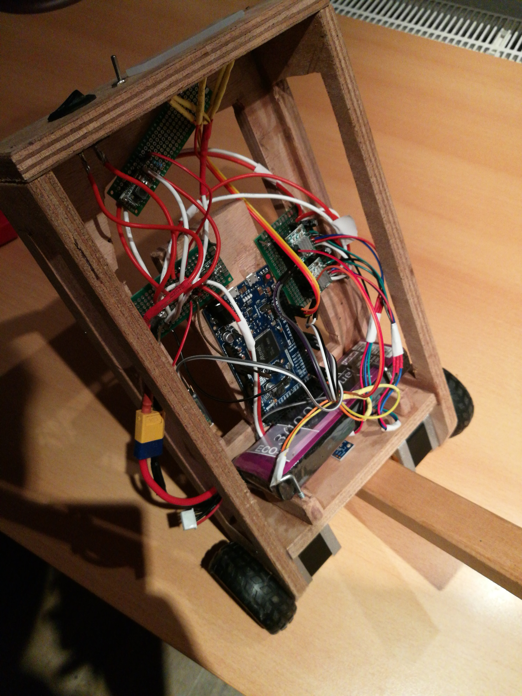
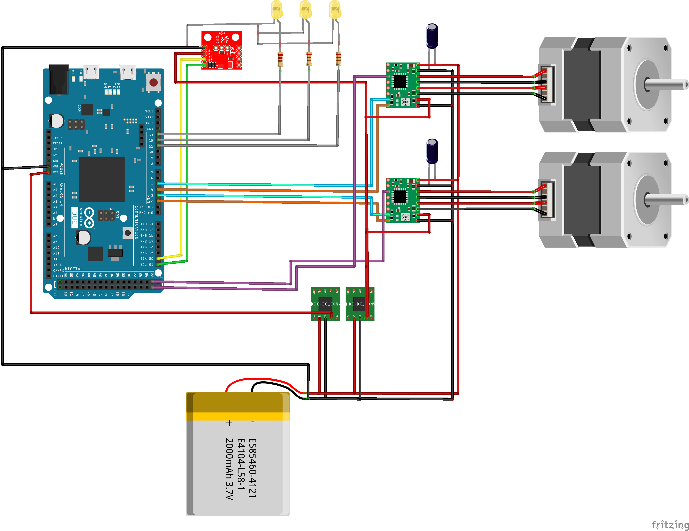

# Balance Robot

Balance Robot controlled using Arduinos. 

## Hardware

For the Hardware, two Arduinos are used as microcontrollers. An Arduino Uno as
the main controller and an Arduino Nano as a motor controller. This is done
because then the motor controller can focus all its resources on motor
controlling which increases the achievable performance. 

The Arduino Uno reads the sensor data from an MPU-9250 to get the angle of the
robot and then computes a control signal which is send to the Arduino Nano. The
Nano then controls the A4988 motor controllers based on this signal. The A4988
motor controllers deliver the appropriate amount of current to the motors. To
make the motors more quiet and more precise, microstepping is used. There is a
tradeoff between motor performance and stepsize. Smaller steps require more
computational power which the Arduino might not be able to deliver. In this
case half steps are used. 

The LEDs give feedback about the current angle of the robot. The middle LED
indicates the angle when the robot is upright. 

The power is provided by a 3 Cell Lipo. This is connected directly to the A4988
controllers as motor voltage input. For the Arduinos the voltage is reduced
using a DC-DC converter to about 7-12V. 
The MPU-9250 sensor is powered by the 5V output of the Arduinos which also power
the internal logic of the A4988 controllers. 

The wiring is shown in the following picture. 

## Software

The control is done using simple PID control. An [PID
library](https://github.com/br3ttb/Arduino-PID-Library) can be found on github.
The output of the PID controller sets the speed of the motor. Important is that
the motors are accelerated to the desired speed in a smooth fashion. This
achieves a smoother motion and also makes sure the motors do not block when the
instantaneous acceleration is too high. In order to enable acceleration, the
[Accel Stepper](https://www.airspayce.com/mikem/arduino/AccelStepper/) library
is used for the motor control. 

In order to obtain the angle from the MPU-9250 breakout, the
[MPU9250](https://github.com/hideakitai/MPU9250) library is used. It provides an
easy interface with the sensor. In my case, the sensor data was very noisy, this
can lead to problems with the control. Therefore, the obtained angle is low pass
filtered before used in the controller. The low pass filter code can be obtained
from
[this](http://www.schwietering.com/jayduino/filtuino/index.php?characteristic=bu&passmode=lp&order=1&alphalow=0.02&noteLow=&noteHigh=&pw=pw&calctype=float&run=Send`)
website. 
